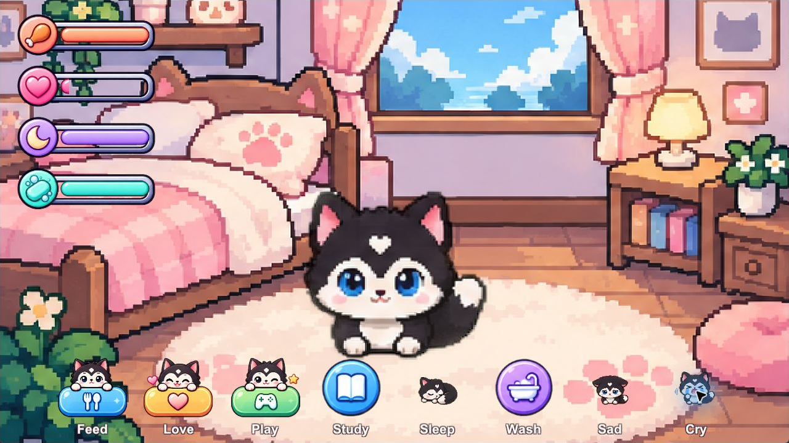

# PocketPet Care

Unity virtual-pet care demo using PocketPet's supplied pup artwork and three unchanged runtime scripts.

Open this repository root in Unity Hub using Unity 6000.5.10f1, then open Assets/Scenes/SampleScene.unity. The source PocketPet project remains separate.

Press Play in Unity. Feed, Love, Play, Study, Sleep, Wash, Sad, and Cry trigger the pet's existing animations. Four bars show hunger, happiness, energy, and cleanliness. Each button also calls a named sound through the supplied AudioManager.

The pet returns to idle after three seconds. Another action restarts that timer. Wash uses the happy animation because no washing clip was supplied. Sad and Cry are mood demonstration buttons.

## Status feedback

| Action | Bar | Value after pressing |
| --- | --- | --- |
| Feed | Hunger | 100% |
| Love | Happiness | 100% |
| Play | Happiness | 90% |
| Study | Energy | 45% |
| Sleep | Energy | 100% |
| Wash | Cleanliness | 100% |
| Sad | Happiness | 30% |
| Cry | Happiness | 10% |

These are fixed feedback values connected through built-in Image components. The supplied scripts do not implement automatic needs decay, sickness, death, or saved progress. Restarting resets all bars to 55%.

## Version and artwork

Unity 6000.2.2f1 installation required Windows administrator approval and failed on the approved retry. This project uses the authorized 6000.5.10f1 fallback. Opening it in 6000.2.2f1 has not been tested.

Artwork can also be downloaded separately from [PocketPet-sprites](https://github.com/Zeref538/PocketPet-sprites) for the lab's slow Wi-Fi. This Unity project contains the assets it needs to run.

Runtime source is limited to PetButtons.cs, AudioManager.cs, and Sound.cs. No helper or editor scripts are included. See [verification](docs/VERIFICATION.md) for measured checks and remaining platform limits.
