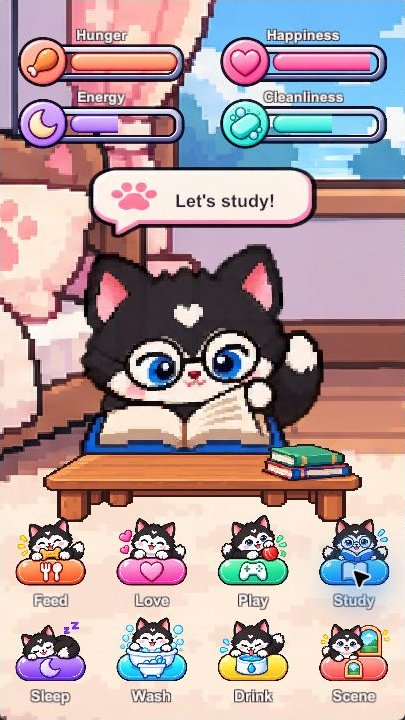

# PocketPet Care

A portrait virtual-pet care demo built in Unity 6000.5.10f1 with only three supplied scripts, unchanged.

Download the [Windows game](https://github.com/Zeref538/PocketPet-Care/releases/tag/v1.1.0), extract the entire ZIP, and open PocketPet Care.exe. Unity is only needed to edit the project. The portrait layout is tested on Windows; this is not an Android or iOS app.

## Play

Eight buttons share one glossy shape, with different colors and a pup performing each action. Each action shows a short speech bubble, calls a supplied sound, and returns to idle after three seconds.

| Button | What appears | Status feedback |
| --- | --- | --- |
| Feed | Bone biscuit and food bowl | Hunger 100% |
| Love | Happy pup | Happiness 100% |
| Play | Pup and red ball | Happiness 90% |
| Study | Glasses, open book, wooden table | Energy 45% |
| Sleep | Sleeping pup in a pink bed | Energy 100% |
| Wash | Pup washing in a tub with bubbles | Cleanliness 100% |
| Drink | Pup lapping from a water bowl | Energy 80% |
| Scene | Bedroom or garden | Existing values preserved |

Idle and the seven care states each use twelve distinct sprite frames at 12 frames per second. Scene toggles scenery without restarting the game. Speech bubbles and extra props disappear at idle.

The bars show fixed action feedback. Automatic needs decay, sickness, death, and saved progress are absent. Restarting resets bars to 55% and restores the bedroom. Sad and Cry remain unused source animation clips; they are no longer action buttons.

## Edit

Add this repository root in Unity Hub with Unity 6000.5.10f1. Open Assets/Scenes/SampleScene.unity and choose a 9:16 aspect ratio in the Game view before pressing Play. The standalone window defaults to 405 by 720; the Canvas reference is 720 by 1280.

Unity 6000.2.2f1 installation failed on the authorized retry because Windows administrator approval was unavailable. This project uses the authorized 6000.5.10f1 fallback. Older-editor compatibility and Mac builds are untested.

Artwork is available separately in [PocketPet-sprites](https://github.com/Zeref538/PocketPet-sprites). The new frame PNGs total 2,990,319 bytes, so artwork can be downloaded without Unity project files.

Runtime source is limited to PetButtons.cs, AudioManager.cs, and Sound.cs. Two instances of the unchanged PetButtons drive the pet and speech-bubble timers. Built-in Animator and Button events handle props and scenery. No helper or editor scripts are included. See [verification](docs/VERIFICATION.md).
